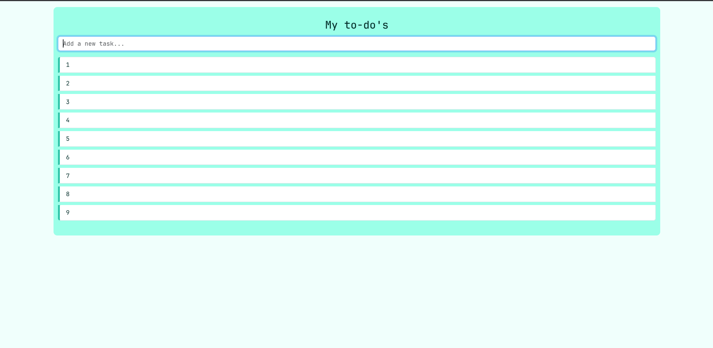

# Assignment To-do / Creating the App
A simple To‑Do web app built for the Web Development Project (part 1). Frontend-only implementation using HTML, CSS (Bootstrap) and JavaScript. Tasks are added dynamically in the browser but are not persisted — refreshing the page clears the list.

Features
Add a new task by typing and pressing Enter
Tasks appear immediately in the list
Minimal, responsive UI using Bootstrap
Tech
HTML
CSS (Bootstrap)
JavaScript
Installation & Use

git clone https://github.com/anasaemd25/Assignment-To-do-Creating-the-App.git
cd Assignment-To-do-Creating-the-App/front-end/todo
# Open index.html in your browser (double-click or use a live server)

Notes
No backend or storage: data is cleared on page reload.
To add persistence, consider using LocalStorage or a simple backend (Node.js + a JSON file or database).

Demo / Screenshots

Contact
anas.aemd@gmail.com
